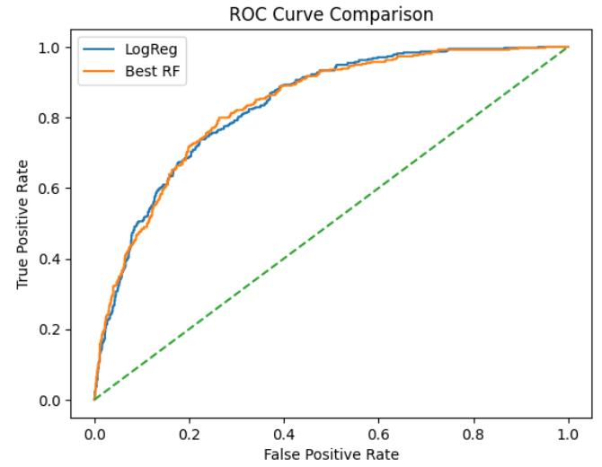

# Telco-Customer-Churn
This project is designed to create a machine learning model that can be used for the prediction of customer churn in a telecommunications company.
The purpose of this project is to identify customers who are likely to churn, which would help in retaining customers.
The project is designed following a structured data science workflow that includes exploratory analysis, feature engineering, optimization, and business evaluation.

## Business Problem
For telecommunications companies, customer churn is a major issue. The loss of existing customers directly affects their top line and also leads to increased customer acquisition costs.

By predicting which customers are likely to churn, companies can: 
- Target high-risk customers
- Offer incentives to retain customers
- Increase customer lifetime value
- Prevent revenue loss
## Dataset

The project uses the **Telco Customer Churn Dataset**.

Source: [click_hear](https://www.kaggle.com/blastchar/telco-customer-churn)

The dataset includes customer information such as:
- demographics
- contract type
- subscribed services
- billing information
- churn status

 
## Project Workflow

The notebook follows an industry-style machine learning workflow:

1. Business Understanding  
2. Data Understanding  
3. Data Cleaning  
4. Exploratory Data Analysis (EDA)  
5. Feature Investigation  
6. Feature Engineering  
7. Data Preprocessing using Pipeline  
8. Modeling Approach  
9. Model Evaluation  
10. Feature Importance Insights  
11. Threshold Optimization  
12. Modeling Summary  
13. Business Recommendations  
14. Conclusion

## Feature Engineering

Several engineered features were created based on patterns observed during analysis:

**CustomerStage**

Tenure determines the stage of the customer lifecycle.
**ServiceCount**

Customer service engagement is represented by the number of services they have subscribed to.

**HighMonthlyCost**
Customers who pay monthly fees that are higher than average are identified by this indicator.

These characteristics help in identifying patterns of behavior associated to churn risk.

## Modeling Approach

Two machine learning models were implemented:
### Logistic Regression
Because it is easy to understand and can show general churn patterns, it is used as a baseline model.
### Random Forest
used to identify non-linear relationships in the data 

The following methods were used to optimize the Random Forest model:
- GridSearchCV
- Stratified 5-Fold Cross-Validation
- ROC-AUC scoring

  
## Model Results

The tuned Random Forest model demonstrated strong predictive capability and outperformed the baseline Logistic Regression model.

Evaluation metrics, including ROC-AUC and Precision–Recall analysis, confirm its ability to effectively distinguish high-risk churn customers.

Key factors influencing churn behavior are further highlighted by feature importance analysis.

## Model Performance

Example evaluation visualization from the model:

## Feature Importance Insights

The main factors influencing churn were identified through feature importance analysis.

The strongest predictor was found to be customer tenure, suggesting that new customers are more likely to leave.

Billing-related factors like **TotalCharges** and **MonthlyCharges** are also significant, indicating that churn behavior may be influenced by perceived service cost.

Longer commitments and higher service engagement are associated with lower churn risk, according to contract type and service adoption variables like **ServiceCount**, **OnlineSecurity**, and **TechSupport**.

## Threshold Optimization

Instead of relying on the default classification threshold (0.5), multiple thresholds were evaluated to balance:

- precision
- recall
- F1 score

This enables the model to align predictions with business priorities such as maximizing churn detection or minimizing unnecessary interventions.

## Key Insights

Customers are more likely to churn when they:

- have shorter tenure
- pay higher monthly charges
- subscribe to fewer services

These insights highlight opportunities for targeted retention strategies.

## Business Recommendations

Based on the analysis and model predictions:

- Give early-stage customers' engagement strategies top priority.
- Provide specific incentives to expensive clients.
- Promote the use of extra services Using model predictions.
-  proactively identify high-risk clients.

These steps can help improve churn prevention strategies.

## Conclusion

This project shows how data-driven customer retention and churn prediction strategies can be supported by machine learning.
By combining exploratory analysis, feature engineering, optimized modeling, and business interpretation, the solution provides both predictive capability and actionable insights for telecom churn management.
